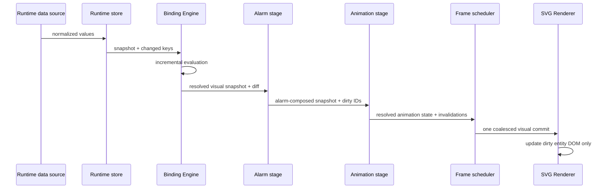

# Runtime, Binding and Renderer Visual Pipeline

Phase 10.09 defines one public execution path for transient visualization:

```text
Runtime store notification
  -> immutable RuntimeSnapshot and RuntimeChangeSet
  -> BindingEvaluationCoordinator
  -> RuntimeBindingVisualSnapshot
  -> RuntimeAlarmIntegrationStage
  -> animation integration stage
  -> frame-batched dirty union
  -> SvgRenderer.renderRuntimeChanges
  -> incremental SVG DOM updates
```

The Binding Engine owns `RuntimeVisualIntegrationPipeline` because it already owns the public
Runtime-to-Binding boundary and depends on Runtime Engine. Stages consume only immutable visual
snapshots and revisioned diffs. They cannot receive a runtime store or renderer reference. The SVG
Renderer remains an apply-only consumer and never evaluates a binding, threshold, animation trigger,
or alarm severity.

## Sequence



## Public API

- `RuntimeVisualIntegrationPipeline` owns lifecycle, stage ordering, batching and isolation.
- `RuntimeAlarmIntegrationStage` converts resolved binding output into `AlarmInput` values and
  additively composes the resulting alarm snapshot.
- `RuntimeVisualIntegrationStage` is the renderer-neutral animation/alarm extension contract.
- `RuntimeDirtyCollector` categorizes node, connection, animation, alarm, label, overlay and viewport
  invalidations without owning a renderer.

Applications inject one shared animation stage per pipeline. A stage may delegate time to
`SharedAnimationScheduler`; it must not allocate entity timers. `setReducedMotion()` and
`setVisibility()` are broadcast to all policy-aware stages. Reduced motion removes decorative motion
inside the animation/alarm resolver while the static alarm state remains in the visual snapshot.

## Lifecycle and multiple renderers

Each pipeline owns its pending dirty union, subscription and (unless injected) frame scheduler.
Instances share no mutable queue. `stop()` unsubscribes binding work and cancels an uncommitted frame;
`dispose()` additionally disposes owned stages and scheduler resources. An externally supplied alarm
engine or scheduler remains caller-owned.

## Migration notes

This phase is additive. Existing `RuntimeBindingRendererIntegration` and
`SvgRenderer.renderRuntimeChanges()` calls remain supported. Applications requiring the complete
Phase 10 path should construct `RuntimeVisualIntegrationPipeline` and pass the SVG renderer as its
consumer. No `ScadaDocument` fields, symbol type IDs, property names or port IDs changed, so persisted
documents require no migration.

## Testing guide

Run focused integration coverage with:

```sh
pnpm vitest run packages/binding-engine/src/runtime-renderer-integration.test.ts \
  packages/runtime-engine/src/dirty-collector.test.ts \
  packages/renderer-svg/src/renderer-dom.test.ts
```

Run the full non-benchmark regression suite with `pnpm test`, browser coverage with
`pnpm test:e2e`, and scaling coverage with `pnpm benchmark`. Browser tests require the three demo
servers configured by Playwright; the command starts them automatically.
